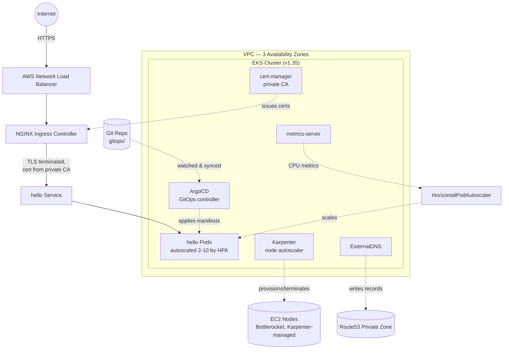

# Production Platform on Kubernetes

A multi-environment, GitOps-driven Kubernetes platform on AWS EKS — built, broken, debugged, and rebuilt end-to-end as a hands-on capability demonstration: *can this engineer design, provision, secure, and operate a production-shaped platform, not just deploy one?*

**Live evidence, not slides.** Every claim in this documentation set is backed by a command run against real AWS infrastructure, with the actual output captured in `docs/INCIDENTS.md` and `docs/TESTING_AND_VALIDATION.md` — including the failures, not just the successes.

---

## 1. Executive Summary

This project provisions a production-pattern EKS platform — 3-AZ networking, GitOps continuous deployment, autoscaling at both the node and pod level, automated TLS, private DNS, and defense-in-depth security controls — entirely through Infrastructure as Code, with every component's behavior proven live rather than assumed from documentation.

**What this demonstrates:** the ability to design a system from first principles, anticipate and reason about failure modes, diagnose real production incidents (not textbook ones), make and document deliberate trade-offs under real constraints (AWS account restrictions, network-level tooling blocks), and operate the resulting system safely — including knowing when and how to tear it down to control cost.

**What this is not:** a tutorial followed step-by-step. Roughly a third of this build involved diagnosing and fixing genuine, undocumented failures — see `docs/INCIDENTS.md` for the full record.

---

## 2. Business Problem

**Stated problem:** demonstrate the capability to build and operate a production Kubernetes platform — not a toy cluster, a system with the actual shape of one a regulated company would run: multi-AZ resilience, automated security posture, GitOps change control, and cost discipline.

**Why this matters in practice:** most Kubernetes learning material stops at "it deployed." Production platforms are defined by what happens when something breaks — an AZ goes down, a node dies mid-deploy, a dependency's API changes, an account-level restriction blocks a resource type nobody warned you about. This project was deliberately run in a way that surfaced those failures for real, then fixed them, rather than following a golden-path tutorial that hides them.

---

## 3. Requirements

| Requirement | Status | Evidence |
|---|---|---|
| Multi-node Kubernetes cluster (multi-AZ) | ✅ Done | `docs/ARCHITECTURE.md` |
| Terraform provisioning | ✅ Done | `infra/*.tf` |
| GitOps (ArgoCD) | ✅ Done | `gitops/`, `docs/TESTING_AND_VALIDATION.md` |
| Helm | ✅ Done | Karpenter, cert-manager, ArgoCD |
| NGINX Ingress | ✅ Done | `docs/TESTING_AND_VALIDATION.md` |
| cert-manager (TLS) | ✅ Done | `docs/SECURITY.md` |
| ExternalDNS | ✅ Done | `docs/TESTING_AND_VALIDATION.md` |
| Horizontal Pod Autoscaler | ✅ Done | `docs/TESTING_AND_VALIDATION.md` |
| Cluster autoscaling (Karpenter) | ✅ Done | `docs/ADR.md` #2 |
| RBAC | ✅ Done | `docs/SECURITY.md` |
| Network Policies | ✅ Done | `docs/SECURITY.md` |
| Pod Security Standards | ✅ Done | `docs/SECURITY.md` |
| Persistent storage | ✅ Done | `docs/INCIDENTS.md` (real incident + fix) |
| DNS and TLS | ✅ Done | private zone + private CA, `docs/ADR.md` #4 |
| Multi-environment (dev/staging/prod) | ✅ Done | `gitops/environments/` |
| CI/CD **pipeline** (build/test/scan gates) | ❌ Not built | see `docs/ROADMAP_AND_GAPS.md` |
| Monitoring dashboards | ❌ Not built | see `docs/ROADMAP_AND_GAPS.md` |

---

## 4. Architecture — Summary

Full diagrams, traffic flow, and failure-point analysis: **`docs/ARCHITECTURE.md`**



---

## 5. Design Decisions and Trade-offs

Full Architecture Decision Records with context, alternatives rejected, and revisit conditions: **`docs/ADR.md`**

Highlights:
- **3 NAT Gateways, not 1 shared** — deliberate HA over ~$70/month savings (ADR #1)
- **Karpenter over Cluster Autoscaler** — modern, faster, right-sized provisioning (ADR #2)
- **Single cluster, 3 namespaces** — not 3 clusters, proportionate to solo/demo scale (ADR #3)
- **Private Route53 zone + private CA**, not public domain + Let's Encrypt — no owned domain, deliberate (ADR #4)
- **Bottlerocket over AL2023 for Karpenter nodes** — real bug found in production, documented and fixed (ADR #5, cross-ref `INCIDENTS.md`)
- **Single merged repo**, not split Terraform/GitOps repos — right call at solo/portfolio scale (ADR #6)

---

## 6. Infrastructure as Code

All infrastructure defined in `infra/*.tf`, state in a versioned, encrypted S3 backend with native S3 locking. Zero manual console changes to any resource Terraform owns — the one deliberate exception (Karpenter's controller IAM policy, sourced from AWS's official CloudFormation template) is documented in ADR #7.

## 7. CI/CD

**Continuous Deployment:** fully implemented via ArgoCD — see `docs/TESTING_AND_VALIDATION.md` for the live zero-downtime deployment proof.

**Continuous Integration (build/test/scan pipeline):** **not implemented.** See `docs/ROADMAP_AND_GAPS.md` for what this would require and why it was out of scope for this phase.

## 8. Security Architecture

Full detail: **`docs/SECURITY.md`** — IAM least-privilege per component, RBAC, NetworkPolicy default-deny, Pod Security Standards, TLS, and the one deliberately deferred item (`terraform-cli`'s `AdministratorAccess`) with an explicit revisit condition.

## 9. Monitoring / Dashboards

**Not implemented.** See `docs/ROADMAP_AND_GAPS.md`.

## 10. Failure Testing / 11. Load Testing

Full detail, live command output, and screenshot placeholders: **`docs/TESTING_AND_VALIDATION.md`**

## 12. Cost Analysis

Full detail: **`docs/CAPACITY_AND_COST.md`**

## 13. Runbook

Full detail: **`docs/RUNBOOK.md`** — how to stand this up, how to tear it down safely, day-2 operations, emergency procedures.

## 14. Incident Postmortems

Full detail: **`docs/INCIDENTS.md`** — every real failure hit during this build, root cause, fix, and prevention.

---

## 15. Setup Instructions — Quick Start

Prerequisites: AWS account, `aws` CLI, `terraform` ≥1.15, `kubectl`, `helm`, `git`.

```bash
git clone https://github.com/velrite/Production-Platform-on-Kubernetes.git
cd Production-Platform-on-Kubernetes/infra
aws configure
terraform init
terraform apply        # ~15-20 min — provisions VPC, EKS, node group

cd ..
chmod +x full-rebuild.sh
./full-rebuild.sh      # installs Karpenter, ArgoCD, Ingress, cert-manager,
                        # ExternalDNS, metrics-server, RBAC, NetworkPolicies,
                        # Pod Security Standards, HPA, multi-env apps
```

Full step-by-step, including what to check at each stage: `docs/RUNBOOK.md`.

## 16. Shutdown Instructions — Stop the Billing Meter

```bash
chmod +x pre-destroy.sh
./pre-destroy.sh       # cleans up LB/DNS/nodes THEN runs terraform destroy
```

**Never run `terraform destroy` directly without this script first** — see `docs/INCIDENTS.md` #6 for exactly why (real multi-hour failure, root cause, and the fix that's now baked into the script).

---

## Screenshot / Evidence Checklist

Upload proof images to `docs/evidence/` and reference them at each bracket below:

- `[SCREENSHOT: architecture diagram rendered in GitHub — confirms Mermaid renders correctly]`
- `[SCREENSHOT: kubectl get nodes — showing multi-AZ Ready nodes]`
- `[SCREENSHOT: ArgoCD UI — all Applications Synced/Healthy]`
- `[SCREENSHOT: browser or curl showing HTTPS cert warning from private CA — proves real TLS]`
- `[SCREENSHOT: zero-downtime deploy — terminal split, curl loop all-200 alongside rollout status]`
- `[SCREENSHOT: node failure recovery — kubectl get pods -w showing reschedule]`
- `[SCREENSHOT: HPA scaling — kubectl get hpa -w showing replica count climb under load]`
- `[SCREENSHOT: AWS Cost Explorer — actual spend for the build period]`
- `[SCREENSHOT: terraform destroy completing cleanly — "Destroy complete"]`

---

*Document set maintained alongside the infrastructure it describes. Last updated to reflect the state after full multi-environment build with RBAC, NetworkPolicies, Pod Security Standards, HPA, and metrics-server confirmed live.*
